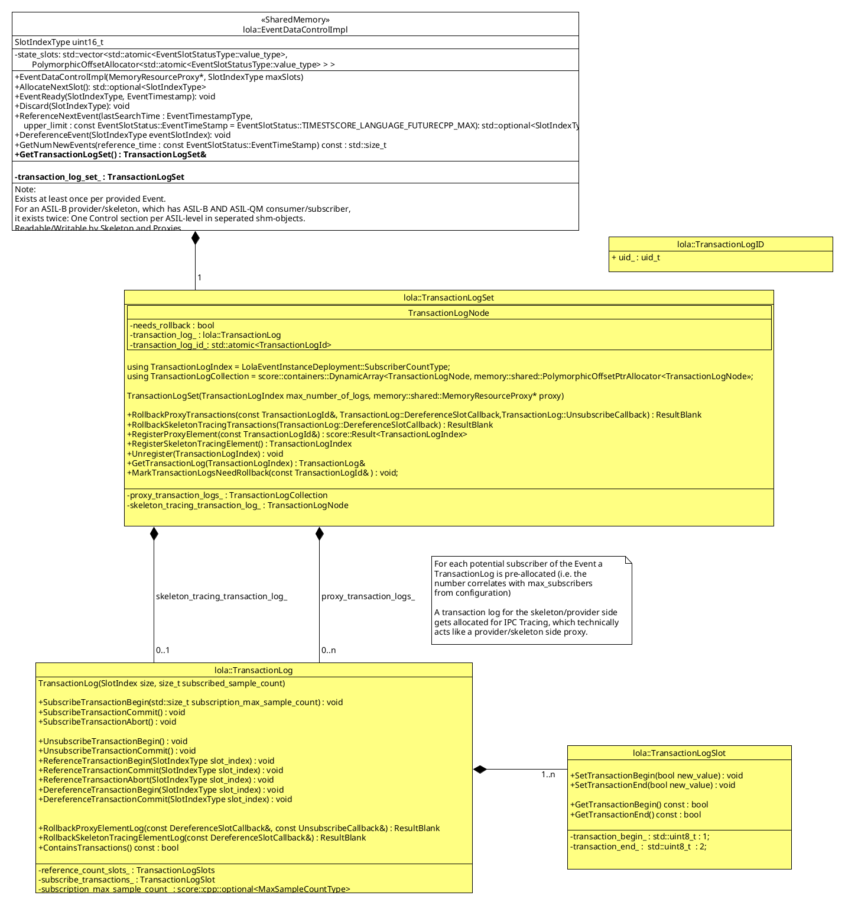
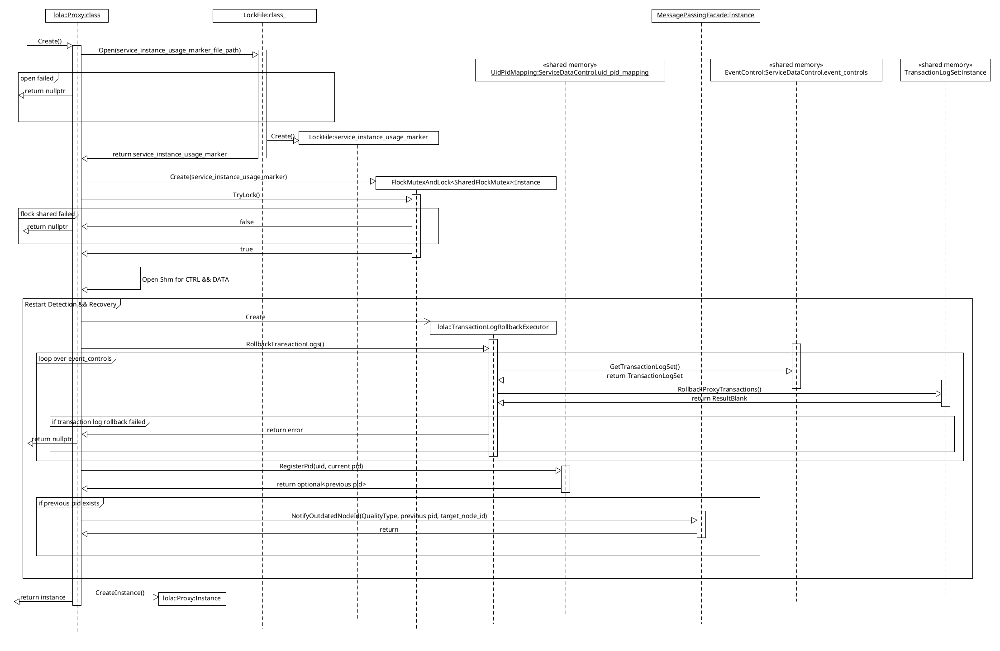
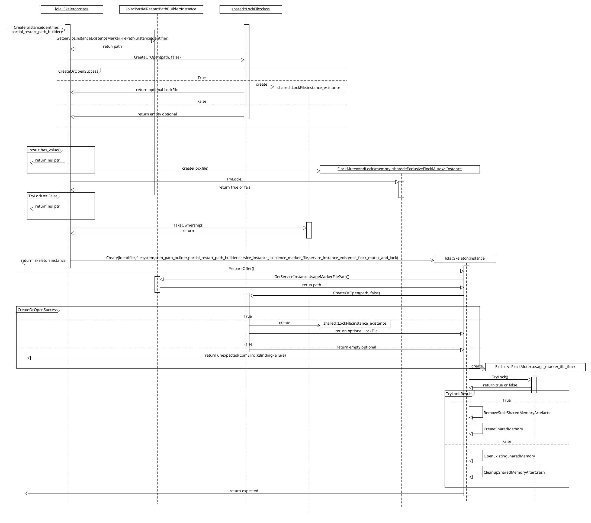

## Partial Restart/Crash Recovery

The concept for partial restart/crash recovery is located [here](../../../../docs/features/ipc/lola/partial_restart/README.md)

### Explanation of Notations being used throughout this design part

`TransactionLog`s as recovery mechanisms described within this document are applied per `ServiceElement` of a `Proxy`
instance. I.e. for every *event*, *field* or *service-method* a given `Proxy` instance contains, a `TransactionLog` is maintained.
We simplify this here and talk only about a `TransactionLog` per `ProxyEvent`, however, in reality we are referring to
a `ProxyEvent`, `ProxyField` or `ProxyMethod`. The `SkeletonEvent` is the counterpart. I.e.
it is the provider side of the event. We typically do have a 1 to N relation; N `ProxyEvent`s may relate to 1
`SkeletonEvent`. A `SkeletonEvent` may also have a `TransactionLog` assigned to it, in case IPC-Tracing is enabled for
it.

### Structural and class diagram extensions

The main extensions on structural level have been done by the addition of `TransactionLog`s. A `TransactionLog`
is maintained per `ProxyEvent`. Each `ProxyEvent` during runtime modifies its shared state (subscribing and 
unsubscribing, and incrementing and decrementing the refcount of event samples) and therefore uses a related
`TransactionLog` to be able to recreate the shared state after restarting.
The `lola::EventDataControlImpl` instance in shared memory manages the control of one `SkeletonEvent`. It has been
extended with a `lola::TransactionLogSet`, which is a collection of all `TransactionLog`s of different N `ProxyEvent`s,
related to the `SkeletonEvent`.

`lola::EventDataControlImpl` and therefore also the contained `lola::TransactionLogSet` is created by the provider/
skeleton side during service instance offering (`Skeleton::OfferService()`). The sizing (how many `Transaction Logs`
shall be contained in a `lola::TransactionLogSet`) is deduced from the `max-subscribers` configuration parameter for
the given `SkeletonEvent`.

Additionally, we also have one `TransactionLog` in the `SkeletonEvent` specific `lola::EventDataControlImpl`
for skeleton/provider side `IPC Tracing`, where technically the `IPC Tracing` subsystem has the role of an event/field
consumer, see description [here](../ipc_tracing/README.md#tracing_subsystem_as_an_event_field_consumer).

Each `ProxyEvent` calls `lola::TransactionLogSet::RegisterProxyElement()` once during initially subscribing to the
`SkeletonEvent`, thereby acquiring an index which uniquely identifies the `TransactionLog` in the
`lola::TransactionLogSet`, allowing it to use the `TransactionLog` throughout its lifetime.

### Identification of transaction logs

A transaction log is associated with a specific `ProxyEvent`. Since transaction logs of `ProxyEvent`s for the same
`SkeletonEvent` are aggregated within one `TransactionLogSet` it needs still distinction to which specific
`ProxyEvent` it corresponds to.
Since transaction logs are stored within shared memory (in the control shm-object) the transaction logs of a
`TransactionLogSet` can come from `ProxyEvent`s from different processes. To identify them, we use a so called
`lola::TransactionLogId`, which currently solely consists of:

- `uid`: UID of the proxy application

Unambiguous assignment from `ProxyEvent`s (contained in proxy instances created within user code) to their corresponding
transaction logs stored in shared memory (`lola::EventDataControlImpl`) is **not** possible, because an application can
create **multiple** proxy instances, either:

- From the same `InstanceSpecifier`,
- from deserialized `InstanceIdentifiers`,
- a mixture of both.

Where the contained `ProxyEvent`s all relate to the exact same (provider side) `SkeletonEvent`. 
Although this is a rather pathological case, we therefore store potentially multiple transaction logs for the same
`lola::TransactionLogId` within a `TransactionLogSet` instance (`TransactionLogSet::proxy_transaction_logs_`).
This is not a problem because when a `ProxyEvent` of a specific proxy instance registers its
`TransactionLog` via `TransactionLogSet::RegisterProxyElement()`, it gets a unique index back (`TransactionLogIndex`).
It uses this index to retrieve its `TransactionLog` from the `TransactionLogSet` throughout its lifetime.
After a crash/restart of the proxy application, this unique index does not need to be retrieved.
This is because when rolling back the `TransactionLog`s (see [transaction log rollback](#transaction-log-rollback)),
it isn't necessary that a `ProxyEvent` of a certain proxy instance rolls back exactly the same `TransactionLog` it had
created in a previous run. It will just roll back the first one with its `TransactionLogId`.

### Synchronization of access to a `TransactionLogSet` instance

The call to `TransactionLogSet::RegisterProxyElement()`, which a proxy event does during `Subscribe` to acquire its
`TransactionLog`, can happen concurrently between different proxy instances in different processes, which all do
subscribe to the same skeleton event instance. Therefore, a synchronization mechanism is needed, to avoid, that two
different proxy event instances end up using the same index/`TransactionLog` within a `TransactionLogSet`.
Initially, we were using an inter process mutex (`score::concurrency::InterProcessMutex`), but abandoned it again as the
error handling gets quite complex, when one (proxy) process dies, while holding the inter process mutex!
Thus, our current solution to synchronize access between proxies with different `TransactionLogId`s (`uid`s) and
therefore located in different processes is based on a lock-free/`atomic`s based algorithm.

During `TransactionLogSet::RegisterProxyElement()` call on a given proxy event instance, we iterate over all entries in
the `TransactionLogSet` and try to acquire an entry via atomic `compare_exchange()` on a
`std::atomic<TransactionLogId>`, which each entry has and which is initialized with `kInvalidTransactionLogId` marking
it as not being used.
After a proxy event instance has successfully acquired an index/`TransactionLog`, it is then used "single-threaded" by
one proxy event instance. During `TransactionLogSet::Unregister()`, the `std::atomic<TransactionLogId>` gets reset to
`kInvalidTransactionLogId` again.

#### Potential failures

If a proxy event instance crashes/dies after acquiring an index/`TransactionLog` and **before** releasing it again in
`TransactionLogSet::Unregister()`, this is no problem: In its next restart, it will anyhow call
`TransactionLogSet::RollbackProxyTransactions()`. This will either fail, in case there are only "broken" transaction
logs for the given `TransactionLogId`, or it will reset the index/`TransactionLog` again to `kInvalidTransactionLogId`.

#### Synchronization of concurrent rollbacks

Since in specific configurations we could have multiple local proxy event instances (with the same `TransactionLogId`)
[see here](#identification-of-transaction-logs), which are potentially concurrently calling
`TransactionLogSet::RollbackProxyTransactions()`. Since this would lead to data races, we explicitly synchronize
(serialize) this case via a standard (process local) mutex.
Therefore, we have a member of type `lola::RollbackSynchronization`, which is stored in `lola::Runtime` and provides a
method `std::pair<std::mutex&, bool> GetMutex(const ServiceDataControl* proxy_element_control)`, which lazily creates
a mutex for the given `ServiceDataControl*`, which identifies the service instance being used. So proxy instances
relating to the same service instance can synchronize their rollback handling via the mutex returned by this API, which
is described [here](#differentiation-between-oldnew-transaction-logs) more thoroughly.

### Proxy side startup sequence

The main usage of the `lola::TransactionLogSet` (and `lola::TransactionLog`) takes place on the proxy side. Before a
proxy instance **even** gets created, checks are done to discover, whether there was a previous run of an application
with the same proxy instance, which has crashed and left a `lola::TransactionLog` with existing transactions
(`TransactionLog::ContainsTransactions() == true`) for one of its `ProxyEvent`s to get recovered:

The (re)start sequence, done during the proxy instance creation, shows three main steps, which have been introduced newly
for the partial restart support:
- Placing shared lock on service instance usage marker file.
- Rolling back existing transaction logs.
- Registration with its current UID/PID pair.

These steps take place within the static creation method `lola::Proxy::Create()`.

#### Placing shared lock on service instance usage marker file

The reason for having a `service instance usage marker file` is documented in chapter
[Usage indicator of shm-objects](broken_link_g/swh/xpad_documentation/blob/master/architecture/architecture_concept/communication/lola/partial_restart/README.md#usage-indicator-of-shm-objects)
of the concept document.
So the 1st step during proxy instance creation is to `open` and `flock` the corresponding `service instance usage marker file`
provided by the skeleton/provider side. If one of these steps fails, proxy creation fails as a whole, which is shown in
the Proxy Restart Sequence above.

The `service instance usage marker file` and the mutex/shared lock created for it are later moved to the created
proxy instance itself, to care for unlocking in the destruction of the proxy. For this reason class `FlockMutexAndLock`
has been created, which allows moving of a mutex and lock in combination.

#### Transaction log rollback

During the creation of a `lola::Proxy` a `lola::TransactionLog` gets rolled back (if one exists) for each of
its `ProxyEvent`s. The transaction logs are contained in a `TransactionLogSet` and therefore specific for
a specific `ProxyEvent` of a proxy instance.
In this step for each `ProxyEvent` of the proxy instance to be created, the related `TransactionLogSet`
is acquired from the `EventDataControl` instance and then
`TransactionLogSet::RollbackProxyTransactions(TransactionLogId)` gets called.

`TransactionLogSet::RollbackProxyTransactions(TransactionLogId)` picks the 1st transaction log it finds for the given
`TransactionLogId` (in typical cases zero or one exist) and tries to roll back. If rollback fails and there is a further
transaction log within the `TransactionLogSet` for the same `TransactionLogId`, then the previous transaction log is
kept in the `TransactionLogSet` and the rollback is done for the next one.

If a transaction-log rollback failed in the context of a `lola::Proxy` creation and no other transaction log could be
rolled back successfully, the creation of the `lola::Proxy` instance fails.
This procedure allows for high-availability: As long as we can free resources previously held by a proxy, we succeed
in re-creation of a proxy instance! A restarting application therefore may be able to run, if it doesn't always create
the same/maximum amount of proxy instances.

##### Differentiation between old and new transaction logs

Since potentially multiple instances of `lola::Proxy` are created during process startup, there will be some concurrency,
so that one `lola::Proxy` instance is still in its creation phase, where it does rollbacks of transaction logs related
to its `ProxyEvent`s, while another instance of a `lola::Proxy` instance has been already created and is
writing or creating new transaction logs. To avoid, that a `lola::Proxy` instance does a rollback of a transaction
log, which is new (has been just created after application/process start), there is a mechanism to mark transaction logs
as `needing rollback`:

The 1st proxy instance within a process (in the specific, rare case, where a process contains multiple proxy instances
for the same service instance) marks all active transaction logs (for all its `ProxyEvent`s) as `needing rollback`.
The guard, that only the 1st proxy instance for a service instance does this specific preparation, is the
`synchronisation_data_map` member within `lola::RollbackSynchronization`, which is held by our singleton
`lola::Runtime`. I.e. the 1st instance adds the service instance specific `ServiceDataControl*` to this map, so that any
further instance sees it and skips doing this preparation step. Therefore, all transaction logs related to the
restarting proxy instance get marked as `needing rollback` initially and any transaction log created later does not have
this marker, which allows for the needed differentiation.

#### UID/PID registration
A proxy instance registers its `uid` with its current `pid` at the `lola::UidPidMapping` member held by
`lola::ServiceDataControl`.
If the `uid` wasn't previously registered, it will get back its current `pid`. Otherwise, it will get back the `pid`,
which it registered in its last run (where it exited normally or crashed). The latter only happens, when the provider
did not remove the shared memory in the meantime and the proxy instance opens/maps exactly the same shared memory object
again.

If `lola::UidPidMapping::RegisterPid()` returns a `pid`, which is not equal to the calling process current `pid`, this
means, the last registration stems from a process/`pid`, which doesn't exist anymore. Then the proxy instance detecting
this shall notify its provider side (where the related skeleton instance is running) about this previous `pid` being
outdated, to allow the target `LoLa` process to clean up any artifacts related to the old/outdated `pid`. This is done
via `MessagePassingFacade::NotifyOutdatedNodeId()`.

Technically there is some **redundancy** in this process: The `uid`/`pid` registration and the entire recovery happens
on the granularity level of a single/specific service instance! Since we could have several proxy instances (either of
different or even the same service type) within one `LoLa` process, which interact with the same remote `LoLa`
(provider) process, the `uid`/`pid` registration is done for each proxy instance and could lead to redundant
notifications via `MessagePassingFacade::NotifyOutdatedNodeId()` to the same target (server/provider) process. This is
no functional problem as the processing of such a `NotifyOutdatedNodeId message` is **idempotent**. To optimize and
avoid redundant message sending, the implementation of `MessagePassingFacade::NotifyOutdatedNodeId()` (which is
technically a process wide singleton anyhow) could cache, to what target nodes it already sent
`NotifyOutdatedNodeId message` and avoid unnecessary resending. Topic will be addressed in ticket `Ticket-130211`.

### Skeleton side startup sequence

Provider resp. skeleton side restart sequence specific extensions for partial restart can be divided in two phases:

1. Creation of skeleton instance
2. Offering of service of the created instance

The following sequence diagram therefore shows both parts:

#### Partial restart specific extensions to Skeleton::Create

So during `lola::Skeleton::Create()` the check/creation/verification of the `service instance existing marker file` is
done (reasoning given in the concept linked in the [beginning](#partial-restartcrash-recovery)). Any failure in
applying an exclusive lock to this marker file results in `Skeleton::Create` failing to provide a skeleton instance.
Like in the `Proxy::Create` case a successfully acquired flock-mutex and its lock are handed over to the `lola::Skeleton`
`ctor`, so that this exclusive lock is consistently held and only freed, when the skeleton instance gets destroyed.

#### Partial restart specific extensions to `Skeleton::PrepareOffer`

In the `Skeleton::PrepareOffer` method the creation of shared-memory objects for the service instance takes place.
Before (for partial restart reasons) the `service instance usage marker file` (reasoning see again the concept paper)
gets created or opened, and it is tried to apply an exclusive lock (`flock`) on this marker file.

If the marker file can be locked, it indicates that there are no connected proxies. Since the previous shared memory
region is not being currently used by proxies, this can mean 2 things:

- The previous shared memory was properly created and `OfferService` finished (the `lola::Skeleton` and all its service
  elements finished their `PrepareOffer` calls) and either no proxies subscribed or they have all since unsubscribed.
- The previous skeleton instance crashed, while setting up the shared memory.

Since we don't differentiate between the 2 cases and because it's unused anyway, we simply remove the old memory region
and re-create it.
If the marker file can **not** be locked, existing shared-memory objects get re-used and slots in state `IN_WRITING`
will be cleaned up.

#### Partial restart specific extensions to `Skeleton::PrepareStopOffer`

Related to the activities in `PrepareOffer`, the skeleton has to decide within `PrepareStopOffer`, whether to remove
shared memory objects created or (re)opened in `PrepareOffer` or not. The decision is done based on the fact, whether
the service instance is currently in use by consumers (represented by proxy instances). This is decided on the ability
of the skeleton to exclusively lock `service instance usage marker file`. Being able to exclusively lock it, assures,
that there aren't any current consumers of the service instance.
