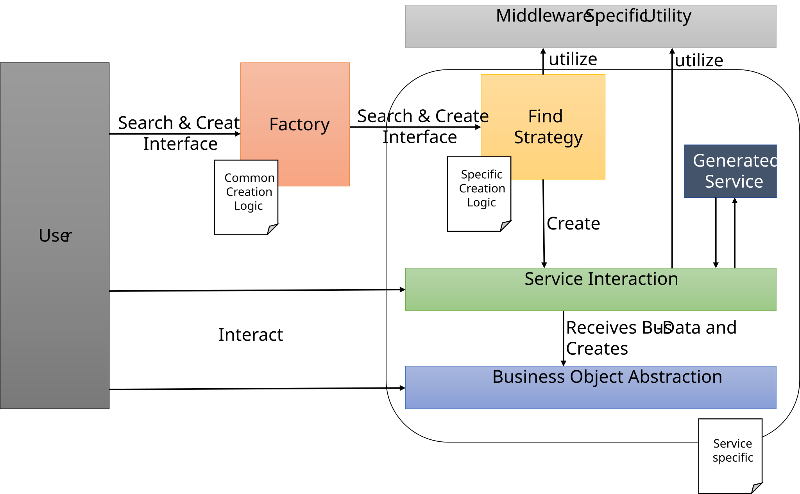
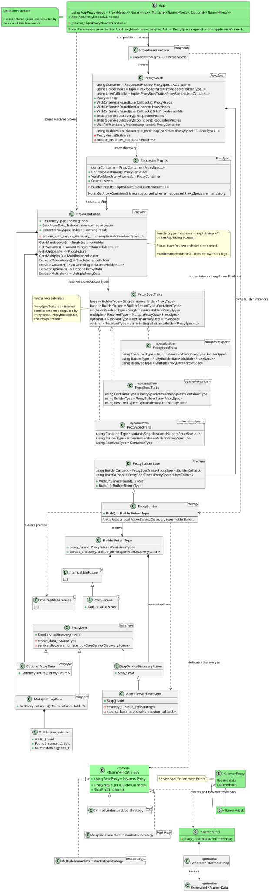
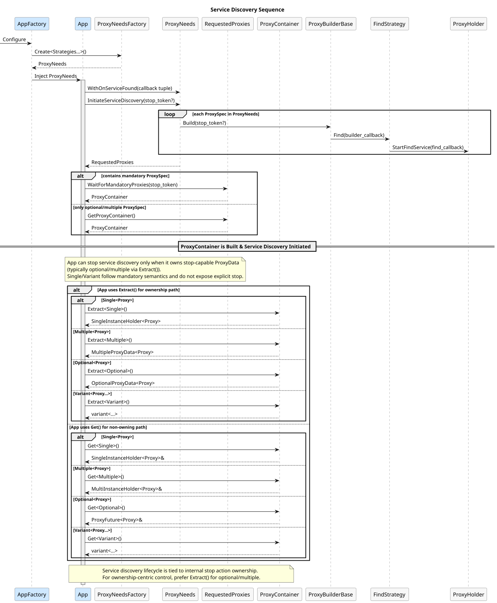
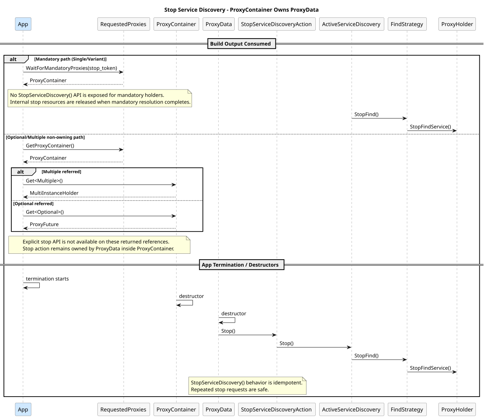
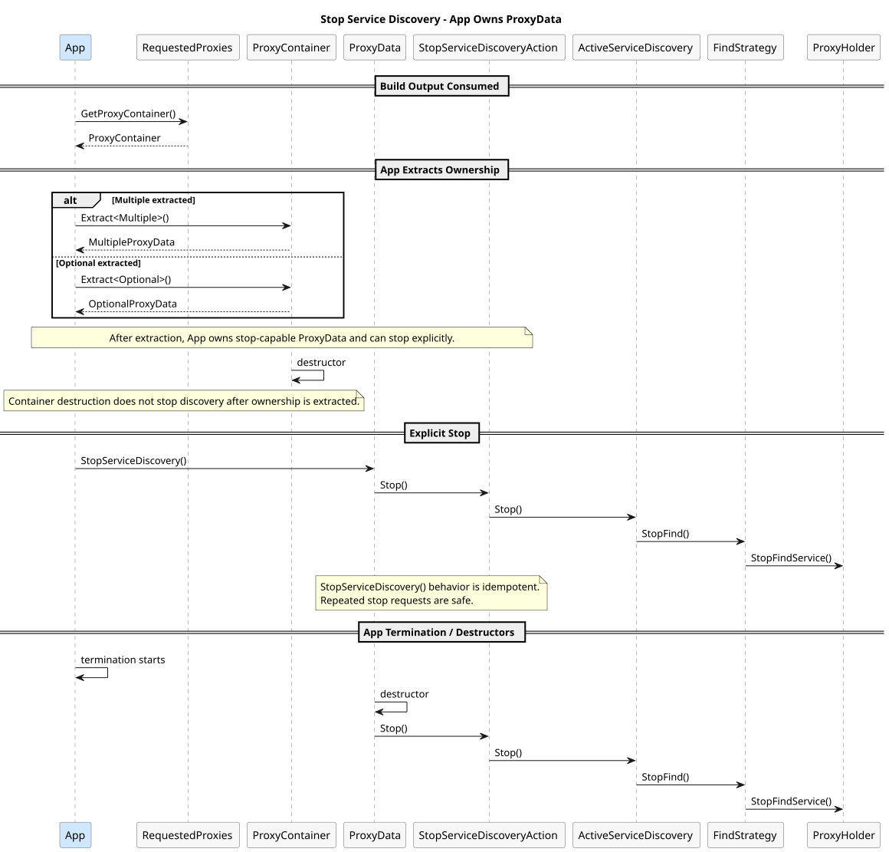
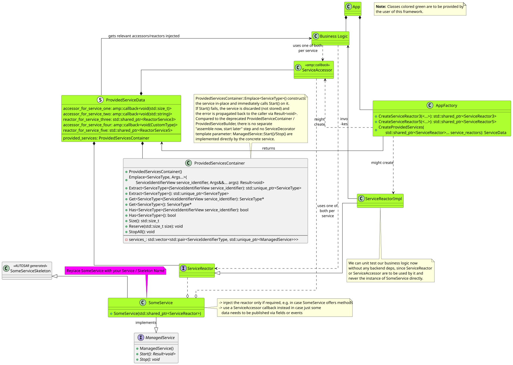

<!--
Copyright (c) 2026 Contributors to the Eclipse Foundation

See the NOTICE file(s) distributed with this work for additional
information regarding copyright ownership.

This program and the accompanying materials are made available under the
terms of the Apache License Version 2.0 which is available at
https://www.apache.org/licenses/LICENSE-2.0

SPDX-License-Identifier: Apache-2.0
-->

# Detailed Design

## Goal

The exchange of information between processes and ECUs is a core pillar of our software architecture. The usage of
general purpose middleware APIs like `mw::com` leads to a wide variance of API usage. In fact, such APIs provide a lot
of flexibility which is or is not needed for our purposes. In addition, such APIs are not easy to integrate into unit
tests, since there is no easy way to fake or mock the API behavior.

Another point is, that we currently have no way to handle interface changes in a backward compatible way. Meaning, that
boardnet changes directly influence our business logic. In order to strive for our platform as a product, we need to
enable supporting multiple boardnet versions in parallel.

This design follows the high-level architecture for multiple boardnet support.

## General Idea

Before diving into the UML-Diagrams, a more high-level view is presented that should help to understand the UML diagrams
later on.



The main idea is to first split the functionality between service-agnostic logic and service-specific logic. This means
that `Factory` and `Middleware Specific Utility` contain only _service-agnostic_ functionality, while `Find Strategy`,
`Service Interaction`, `Generated Service` and `Business Object Abstraction` can be _service-specific_. The general idea
with these entities is to provide one or more default implementations if needed to cover common cases while still being
able to provide customization where necessary.

The root-cause of this design is located within the `Generated Service`. It represents the middleware specific service
instance. Like an `mw::com` service instance. Basically this design does not influence this part at all, it's just the
building block, which we build the other parts around.

The `Service Interaction` shall be the controlling instance of the `Generated Service`, abstracting the middleware
specific APIs into business logic related ones. For example a `VinProvider` implementation of the `Service Interaction`
might provide a `GetVin()` functionality, that retrieves the `Vin` `Business Object Abstraction`. How
the `Service Interaction` gets the data is irrelevant for the user of this API. Meaning, it can either be done via
events, fields or methods. The user of the `Service Interaction` at the end does not care.

Talking about the `Business Object Abstraction`, this part wraps the data provided by the bus and provides business
logic related operations. The idea is to wrap the received data into an object and provide accessor and modifying
methods to the core application. Changes in the actual data representation will then only lead to local changes as long
as the information and operations required by the core application logic stay the same. For example, it might be
necessary to compare the received Vin with the one installed in the ID certificate. The right solution would be to
construct another `Business Object Abstraction` `Vin` from the certificate and then use the implemented equal operator
within the `Business Object Abstraction` to compare both objects. A wrong approach would convert the certificate vin
into an array of 17 byte, because we receive the Vin on the boardnet of 17 byte and then compare these two arrays of
byte. The difference might seem subtle and negligible at this far simple example, but at scale it matters. A future
change of the data representation of the Vin, might cause refactorings in the business logic if done wrong. If done
correct, this only affects the `Business Object Abstraction`.

Depending on the needs of the application it is up to the developer of the application to either provide mockable
references to a virtual base class or concrete classes where the `Service Interaction` object will take care of mocked
data. Both ways will help unit testing the application core without the need to know the concrete representation of a
certain business object on the target or in other parts of the system.

Both parts, `Service Interaction` and `Business Object Abstraction` will have nearly no duplicated boilerplate code. If
they do, that shall be placed in the `Middleware Specific Utility`.

So far we only talked about how the user can interact with the service and the received data. The last missing part is
how the `Service Interaction` is created. For that, the user uses a `Factory`. The `Factory` will instantiate a service
specific `FindStrategy`. Within the `FindStrategy` we can then implement service-specific conditions for which services
we are looking for. Backend-specific discovery details are documented in the [backend subfolders](./backend/). At the
end, when a service is found, the `FindStrategy` creates the `Service Interaction` which then is moved into a callback
provided by the `Factory`, which provides the `Service Interaction` back to the user. This more complicated behavior
enables a clean and unit-testable interface towards the user, while we keep up the possibility of service-specific
discovery actions.

## Service Discovery Use-Cases

The service discovery is one of the main building blocks, which also leaves most room for variance. We have checked our
current codebase and found the following use-cases:

* mandatory proxy
* optional proxy
* one of different proxies (not instances, but real different proxies)
* subscribe to event after the service has been found (user specific action)
* find multiple instances of one proxy

These cases mainly influence the following design and can be seen as additional requirements towards the goals set in
the upper sections.

## Service Offering Use-Case

The service offering is way less complex than the service discovery, since it only knows two states. Either the service
is offered, or not. In general, we strive for the same goals on service offering like on discovery. Meaning, we want to
have our business logic separated from actual middleware implementation.

## UML

### Required Proxies

In general each user facing part is covered by an interface. Generated classes are identified via a respective
stereotype.

The abstract factory (`ProxyBuilderBase`) has a templated implementation that takes a find strategy as its template
argument. This enables the usage of different find strategies depending on the use case: for a middleware-backed
target you will want to use the service discovery capabilities of the corresponding backend, while for testing
purposes, you might want to immediately instantiate a mock class, or you might want to immediately fail to test the
fault reaction paths inside your application.

For that part, the factory will default instantiate the find strategy (`<Name>FindStrategy`) and invoke `Find()` with a
factory specific callback. This callback will vary between the three different build options: Mandatory Proxy, Optional
Proxy or Multiple Proxies. The find strategy then starts middleware specific service discovery actions. The main part
being that it invokes the mentioned factory callback once the service is found. After it created the service instance
(`<Name>Proxy`) with the necessary information from the middleware specific proxy instance.

The `ConcreteDataObject` represents the earlier mentioned `Business Object Abstraction`.

One of the cornerstones to make this work is `AbortableFuture`: A shortcoming of `std::future` is its lack of support
for `stop_token`. In case of a shutdown where we have to terminate during initialization phase, the service discovery
would continue to run indefinitely with this design. `AbortableFuture` allows us to store a callback that captured a
`std::shared_ptr` to the `FindStrategy` which enables us to properly shut down the service discovery.

In order to ease the user API, we extended the Builder infrastructure even further. An application shall now be able to
define _needs_ via `ProxyNeeds`. The idea is basically that a user can define mandatory, optional and variant proxies.
We use tagged meta-programming to define this. So if a user wants to have an optional proxy he would say
`ProxyNeeds<Optional<XXX>>`. On the other side he would say `ProxyNeeds<Variant<XXX, YYY>>` if he needs
either one of the proxies. By using variadic templates, we support here any number of needed proxies in any needed
configuration (e.g. an optional variant). It is important to name again, that the user defines the needs based on the
interfaces (`<Name>Proxy`).

The `ProxyNeeds` should then be injected into the application via the `ProxyNeedsFactory`. The factory also uses
variadic templates. The difference towards the needs is now, that the factory uses the `<Name>FindStrategy` as template
parameter. Thus, bridging the gap between the concrete services to find and the interfaces to use within the business
logic.

#### Static View



#### Sequence Creation



#### Sequence Stop




### Provided Services

mw/service is intended to be used by an application on the provider side (i.e. when sending data via a service) when the
application:

* Knows a certain set of service instances to be offered before offering.
* Wants to offer this set of services at the same time.
* Wants to stop offer this set of services at the same time.

If these conditions are not met, then the application has two options:
    a) define multiple distinct sets of services where each one then individually fulfills the above-mentioned criteria.
    b) use the communication (e.g. `mw::com`) interface directly.

Provided services need to be held by applications for as long as the application wants to offer the service. In order
to do so, we introduce `ProvidedServicesContainer` to hold these services (or a single service).
The main idea is that we implement service accessors and/or service reactors independent of the
underlying middleware, meaning the business logic is implemented without any reference to generated skeletons or
middleware-specific wrappers. The only thing to be done is to create a connection between the actual service instance
(`SomeService`) and our service accessors and/or service reactors. This shall be done either within the implementation
of the service instance (`SomeService`) by injecting an instance of a reactor or within the application factory
(`AppFactory`) by wrapping a callback around the actual service instance. In the best case, `SomeService` just delegates
calls to the service reactor, in other cases it is required to perform conversions from our business logic to the
generated types.

#### Generic Service Interface
`mw::service` interacts with user-defined services in a generic way through the `ManagedService` interface. The
user-defined service directly inherits from `ManagedService` and implements `Start()` (offering the service, returning
a `Result<void>` so that failures can be detected and propagated) and `Stop()` (stopping the offer). When using the
`mw::com` binding, the user-defined service should wrap (rather than inherit from) the generated Skeleton, and delegate
`Start()`/`Stop()` to the Skeleton's `OfferService()`/`StopOfferService()`.

This keeps the adapter overhead within `mw/service` minimal while still making unit-testing of the application's
business logic way simpler since it does not depend on any generated service skeletons.

Backend-specific service implementation examples are documented in the backend subfolders.
Refer to [./backend/mw_com/README.md](./backend/mw_com/README.md) for mw::com use case.

The following example shows the intended style:

```C++
class Tick
{
  public:
    virtual ~Tick() = default;
    virtual bool IsStrictlyMonotonic() const = 0;
};

class TickMock final : public Tick
{
  public:
    bool IsStrictlyMonotonic() const override { return true; }
};

struct TickMockFactory
{
    std::unique_ptr<Tick> operator()() { return std::make_unique<TickMock>(); }
};

MyApplication ApplicationFactory::Create()
{
    using TickProxyStrategy =
        mw::service::ImmediateInstantiationStrategy<Tick, TickMockFactory>;
    auto builder = mw::service::ProxyNeedsFactory<ProxyNeeds>::Create<TickProxyStrategy>();

    return MyApplication{std::move(builder)};
}
```

#### Static View



### Find Strategies

As mentioned before, the user is supposed to provide a Strategy class that will determine how to connect to the desired service.
The framework provides backend-specific strategy families, but the users could also implement their own.

Backend-specific strategy details are documented in the [backend subfolders](./backend/):
- [mw::com backend](./backend/mw_com/README.md)
